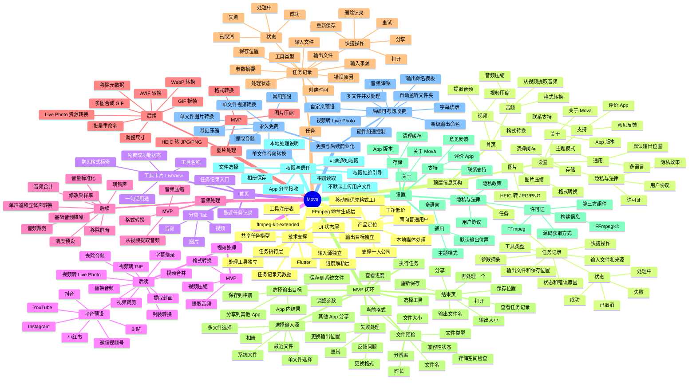

# Mova 产品功能思维导图

```mermaid
mindmap
  root((Mova))
    产品定位
      移动端优先格式工厂
      本地媒体处理
      干净低价
      面向普通用户
      支撑一人公司
    顶层信息架构
      首页
        视频
          格式转换
          视频压缩
          提取音频
        音频
          格式转换
          音频压缩
          从视频提取音频
        图片
          格式转换
          图片压缩
          HEIC 转 JPG/PNG
      任务
        任务记录
          状态
            处理中
            成功
            失败
            已取消
          输入文件和来源
          输出文件和保存位置
          工具类型
          参数摘要
          状态和错误原因
          快捷操作
      设置
        通用
          多语言
          主题模式
          默认输出位置
        支持
          意见反馈
          联系支持
          评价 App
        隐私与法律
          隐私政策
          用户协议
          许可证
        存储
          清理缓存
        关于
          App 版本
          关于 Mova
    首页
      分类 Tab
        视频
        音频
        图片
      工具卡片 ListView
        工具名称
        一句话用途
        常见格式标签
        免费或功能状态
      任务记录入口
      最近任务记录
    视频处理
      MVP
        格式转换
        视频压缩
        提取音频
      后续
        视频转 GIF
        视频转 Live Photo
        视频裁剪
        视频合并
        去除音频
        替换音频
        提取封面
        字幕烧录
        封装转换
        平台预设
          B 站
          抖音
          小红书
          微信视频号
          YouTube
          Instagram
    音频处理
      MVP
        格式转换
        音频压缩
        从视频提取音频
      后续
        基础音频降噪
        音量标准化
        音频裁剪
        音频合并
        转铃声
        修改采样率
        单声道和立体声转换
        移除静音
        响度预设
    图片处理
      MVP
        格式转换
        图片压缩
        HEIC 转 JPG/PNG
      后续
        调整尺寸
        WebP 转换
        AVIF 转换
        GIF 拆帧
        多图合成 GIF
        批量重命名
        移除元数据
        Live Photo 资源转换
    任务
      任务记录
        状态
          处理中
          成功
          失败
          已取消
        输入文件
        输入来源
        输出文件
        保存位置
        工具类型
        参数摘要
        创建时间
        处理状态
        错误原因
        快捷操作
          打开
          分享
          重新保存
          重试
          删除记录
    MVP 闭环
      选择工具
      选择输入源
        相册
        系统文件
        其他 App 分享
        最近文件
        单文件选择
        多文件选择
      文件预检
        文件名
        文件类型
        文件大小
        时长
        分辨率
        当前格式
        兼容性状态
        存储空间检查
      调整参数
      选择输出目标
        App 内结果
        保存到相册
        保存到系统文件
        分享到其他 App
      执行任务
      查看进度
      结果页
        输出文件名
        输出大小
        保存位置
        打开
        分享
        重新保存
        再处理一个
        查看任务记录
      失败处理
        重试
        更换格式
        更换输出位置
        反馈问题
    设置
      通用
        多语言
        主题模式
        默认输出位置
      支持
        意见反馈
        联系支持
        评价 App
      隐私与法律
        隐私政策
        用户协议
        许可证
          FFmpegKit
          FFmpeg
          第三方组件
          构建信息
          源码获取方式
      存储
        清理缓存
      关于
        App 版本
        关于 Mova
    权限与信任
      相册读取
      相册保存
      文件选择
      App 分享接收
      可选通知权限
      本地处理说明
      权限拒绝引导
      不默认上传用户文件
    免费与后续商业化
      永久免费
        单文件视频转换
        单文件音频转换
        单文件图片转换
        基础压缩
        提取音频
        常用预设
      后续可考虑收费
        多文件并发处理
        输出命名模板
        视频转 Live Photo
        音频降噪
        字幕烧录
        硬件加速控制
        自定义预设
        自动监听文件夹
        高级输出命名
    技术支撑
      Flutter
      ffmpeg-kit-extended
      共享任务模型
      工具注册表
      输入源独立
      处理工具独立
      输出目标独立
      FFmpeg 命令生成层
      任务执行层
      进度解析层
      UI 状态层
      任务记录元数据
```
