# Mova 产品功能架构

## 这份文档解决什么

顶层信息架构适合表达页面和导航，例如首页、任务、设置。产品功能架构适合表达能力模块，例如视频处理、音频处理、输入源、输出目标、任务记录、权限、错误处理。

两者不要混在一张树里：

- 信息架构：用户从哪里进入功能。
- 功能架构：产品实际有哪些能力。
- MVP 闭环：用户如何完成一次真实处理任务。

## 功能架构总览

```mermaid
flowchart TB
  A[Mova] --> B[媒体处理能力]
  A --> C[文件输入能力]
  A --> D[文件输出能力]
  A --> E[任务记录能力]
  A --> F[设置与信任能力]
  A --> G[后续效率增强能力]

  B --> B1[视频处理]
  B --> B2[音频处理]
  B --> B3[图片处理]

  B1 --> B11[格式转换]
  B1 --> B12[视频压缩]
  B1 --> B13[提取音频]
  B1 --> B14[后续: 视频转 GIF]
  B1 --> B15[后续: 视频转 Live Photo]

  B2 --> B21[格式转换]
  B2 --> B22[音频压缩]
  B2 --> B23[后续: 音频降噪]
  B2 --> B24[从视频提取音频]

  B3 --> B31[格式转换]
  B3 --> B32[图片压缩]
  B3 --> B33[HEIC 转 JPG/PNG]

  C --> C1[相册]
  C --> C2[系统文件]
  C --> C3[其他 App 分享]
  C --> C4[最近文件/任务记录]

  D --> D1[App 内结果]
  D --> D2[保存到相册]
  D --> D3[保存到系统文件]
  D --> D4[分享到其他 App]

  E --> E1[处理中]
  E --> E2[成功]
  E --> E3[失败]
  E --> E4[已取消]
  E --> E5[打开/分享/重试/删除]

  F --> F1[多语言]
  F --> F2[意见反馈]
  F --> F3[隐私政策/用户协议/许可证]
  F --> F4[清理缓存]
  F --> F5[关于 Mova]

  G --> G1[多文件并发处理]
  G --> G2[输出命名模板]
  G --> G3[高级预设]
  G --> G4[平台预设]
```



## 页面入口和功能模块的关系

| 页面入口 | 承载功能 | MVP 必需 | 说明 |
| --- | --- | --- | --- |
| 首页 | 视频、音频、图片分类 Tab | 是 | 用户发现工具的主要入口 |
| 视频 Tab | 视频格式转换、视频压缩、提取音频 | 是 | 首版最强价值分类 |
| 音频 Tab | 音频格式转换、音频压缩、从视频提取音频 | 是 | 与视频能力复用较多 |
| 图片 Tab | 图片格式转换、图片压缩、HEIC 转 JPG/PNG | 是 | 补齐格式工厂感知 |
| 任务页 | 任务记录、状态、进度、重试、分享、删除 | 是 | 不拆当前任务，统一由状态表达 |
| 设置页 | 多语言、意见反馈、协议、许可证、清理缓存、关于 | 是 | 信任和基础偏好入口 |

## 功能模块清单

### 1. 视频处理

| 功能 | MVP | 用户价值 | 备注 |
| --- | --- | --- | --- |
| 格式转换 | 是 | 把视频转成常用格式 | 优先 MP4/MOV/MKV/WebM |
| 视频压缩 | 是 | 减小文件体积，便于分享 | 参数要尽量任务化 |
| 提取音频 | 是 | 从视频里拿出音频 | 和音频分类复用 |
| 视频转 GIF | 后续 | 制作动图 | 注意时长和体积限制 |
| 视频转 Live Photo | 后续 | 高感知价值功能 | 移动端特色能力 |
| 视频裁剪 | 后续 | 截取片段 | 不做复杂时间线 |
| 视频合并 | 后续 | 合并多个片段 | 可放在增长阶段 |
| 字幕烧录 | 后续 | 给视频加硬字幕 | 复杂度较高 |
| 平台预设 | 后续 | 适配发布平台 | 适合增长阶段 |

### 2. 音频处理

| 功能 | MVP | 用户价值 | 备注 |
| --- | --- | --- | --- |
| 格式转换 | 是 | 转 MP3/WAV/AAC 等常见格式 | 基础能力 |
| 音频压缩 | 是 | 减小音频体积 | 与格式转换复用 |
| 基础音频降噪 | 后续 | 改善录音质量 | 质量敏感，先不进入 MVP |
| 从视频提取音频 | 是 | 视频转音频 | 与视频分类复用 |
| 音量标准化 | 后续 | 让声音更稳定 | 适合播客/口播 |
| 音频裁剪 | 后续 | 截取片段 | 轻量编辑 |
| 音频合并 | 后续 | 拼接多个音频 | 多文件能力后补 |

### 3. 图片处理

| 功能 | MVP | 用户价值 | 备注 |
| --- | --- | --- | --- |
| 格式转换 | 是 | JPG/PNG/WebP 等转换 | 基础能力 |
| 图片压缩 | 是 | 减小图片体积 | 高频需求 |
| HEIC 转 JPG/PNG | 是 | 解决 iPhone 图片兼容问题 | 移动端高价值 |
| 调整尺寸 | 后续 | 多文件调整图片尺寸 | 适合增长阶段 |
| GIF 拆帧/合成 | 后续 | 动图处理 | 非首版必需 |
| 移除元数据 | 后续 | 隐私处理 | 可与信任卖点结合 |

### 4. 输入源

| 输入源 | MVP | 说明 |
| --- | --- | --- |
| 相册 | 是 | 视频和图片最主要来源 |
| 系统文件选择器 | 是 | 覆盖音频、视频、图片和下载文件 |
| 其他 App 分享进入 | 是 | 移动端关键入口 |
| 最近文件/任务记录 | 是 | 方便重复处理 |
| 网盘导入 | 后续 | 涉及登录、授权、传输和客服复杂度 |
| 网络 URL 导入 | 后续 | 容易产生版权和稳定性问题 |

输入源默认支持单文件和多文件选择。选择多个文件时，不进入独立的“批量任务”入口，而是用同一套处理参数为每个输入文件生成一条任务记录。

### 5. 输出目标

| 输出目标 | MVP | 说明 |
| --- | --- | --- |
| App 内结果 | 是 | 确保任务完成后有地方可找 |
| 保存到相册 | 是 | 视频/图片核心出口 |
| 保存到系统文件 | 是 | 通用出口 |
| 分享到其他 App | 是 | 微信、QQ、邮件、网盘等依赖系统分享 |
| 网盘导出 | 后续 | 暂不进入 MVP |

### 6. 任务记录

| 字段/能力 | MVP | 说明 |
| --- | --- | --- |
| 状态 | 是 | 处理中、成功、失败、已取消 |
| 输入文件和来源 | 是 | 便于用户理解任务从哪里来 |
| 输出文件和位置 | 是 | 解决“文件去哪了” |
| 工具类型 | 是 | 例如视频压缩、图片转换 |
| 参数摘要 | 是 | 例如输出格式、压缩等级 |
| 错误原因 | 是 | 失败时必须能看懂 |
| 快捷操作 | 是 | 打开、分享、重新保存、重试、删除 |
| 长期保留策略 | 后续 | 视存储和商业化再定 |

### 7. 设置与信任

| 功能 | MVP | 说明 |
| --- | --- | --- |
| 多语言 | 是 | 至少预留结构 |
| 默认输出位置 | 是 | 降低重复选择成本 |
| 意见反馈 | 是 | 放在支持分组 |
| 隐私政策 | 是 | 处理用户文件必须具备 |
| 用户协议 | 是 | 上架和合规需要 |
| 许可证 | 是 | FFmpegKit、FFmpeg、第三方组件披露 |
| 清理缓存 | 是 | 视频处理会占空间 |
| 关于 Mova | 是 | 版本、产品信息 |
| 联系支持 | 后续 | 可与意见反馈合并起步 |
| 评价 App | 后续 | 有一定用户量后再加 |

## MVP 功能边界

MVP 应该优先保证以下能力完整：

```text
发现工具
-> 选择输入源
-> 文件预检
-> 设置参数
-> 选择输出目标
-> 执行任务
-> 任务记录显示状态
-> 结果页打开/保存/分享
-> 失败可重试或反馈
```

首版不要追求工具数量，而要保证每个已上线工具都能完成闭环。

## 后续功能池

后续功能不要全部堆进首页。可以按照价值逐步进入对应分类：

| 阶段 | 功能方向 | 示例 |
| --- | --- | --- |
| 增长阶段 | 更多媒体小工具 | 视频裁剪、音频裁剪、调整图片尺寸 |
| 效率阶段 | 多文件效率能力 | 并发处理、输出命名模板、自动化规则 |
| 创作者阶段 | 发布预设 | B 站、抖音、小红书、YouTube |
| 信任阶段 | 隐私和清理 | 移除元数据、缓存管理增强 |
| 商业化阶段 | 高级能力 | 高级预设、多文件自动化、平台预设包 |

## 推荐使用方式

- 用顶层信息架构决定导航和页面。
- 用这份功能架构决定功能范围和优先级。
- 用 MVP 闭环检查每个工具是否能真正交付结果。
- 用任务记录模型约束所有处理任务的数据结构。
- 用输入文件数量决定任务记录数量，不单独设计批量任务入口。
